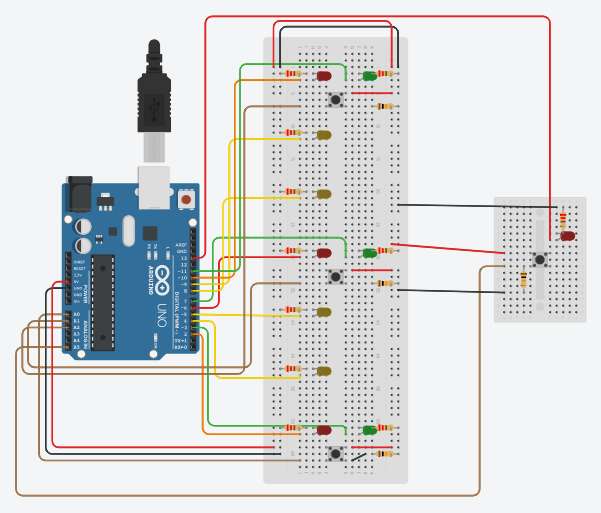

# 🚗 Arduino Elevator Simulation

Arduino Uno 보드를 기반으로 구현한 간단한 엘리버터 시뮬레이션입니다.  
칸과 이동은 millis 기반 비동기 방식으로 처리되며, LED와 버튼을 통해 호출 및 상태 표현을 직관적으로 확인할 수 있습니다.

---

## 파라미터 개요

- **프로젝트명**: Arduino Elevator Simulation
- **주요 기술**: Arduino(C++), millis(), LED 제어, 상태기반 시뮬레이션
- **실행 환경**: Arduino Uno, Tinkercad 또는 실제 보드

---

## 회로 구성 사진

---

## 주요 기능

- **LED를 통한 상태 표시**
  - RED: 엘리버터 현재 위치 표시
  - GREEN: 해당 칸 호출 유무 표시
  - YELLOW: 칸과 이동 상태 표현 (3초 시켜어진 LED)

- **칸별 호출 버튼 입력**
  - 버튼 입력에 따라 호출 상태를 통기 (ON/OFF)
  - 호출된 상태는 GREEN LED로 시각화

- **비동기 이동 처리**
  - `millis()` 기반으로 1초 단위로 칸과 이동
  - 이동 시 RED → YELLOW → YELLOW → RED로 LED 시킨스 점등

- **상태 기반 로직**
  - `STOP` / `MOVING` 상태 구분
  - 호출 방향 판단 (UP / DOWN)
  - 호출이 있을 경우에만 이동 시작

- **비상 정지 기능 (추후 구현 예정)**  
  - EMERGENCY 버튼과 LED 핏 정의는 있으나, 현재 동작 로직 무관

---

## 실행 방법

1. Arduino IDE 또는 [Tinkercad 시뮬레이터](https://www.tinkercad.com/things/fmIV2W00RRL-arduinoonedayprojectelevator)에 접속

2. `elevator.ino` 코드를 업로드

3. 각 핏 연결 확인 (다음은 예시)

| 구성 요소 | 핏 번호 |
|:--|:--|
| RED_LED | 2, 6, 10 |
| GREEN_LED | 3, 7, 11 |
| YELLOW_LED | 4, 5, 8, 9 |
| CALL_BUTTONS | A0, A1, A2 |
| EMERGENCY_LED | 13 |
| EMERGENCY_BUTTON | A5 |

4. 시뮬레이션 실행 후 버튼을 누르면 호출 상태 및 LED 반응 확인

---

## 상태 정의(enum)

```cpp
enum ElevatorDirection { DOWN = 0, UP };
enum ElevatorMoveStatus { STOP = 0, MOVING };
enum CallStatus { NOTCALL = 0, CALL };
enum UseStatus { CAN_USE = 0, CANT_USE };
```

- 호출 상태에 따라 방향과 움직임 제어
- 버튼 입력 변화 감지 시 호출 상태 ON/OFF
- `floor_status_list`, `moving_call_onetime_check`, `moving_sec_onetime_check` 등 변수들을 통해 내림 상태 추적

---

## 라이센스

이 프로젝트는 [MIT License](./LICENSE) 하에 배포됩니다.

---

## 추가 개발 예정

- **비상 정지 버튼 기능 완성**: 비상 시 정지 및 LED 점면 구현
- **도여 개발 시뮬레이션**: 칸 도차 시 모터 또는 서보 활용하여 도여 열차 역할 연출
- **칸 수 확장**: 현재 3칸 구조를 더 많은 칸으로 확장 가능하게 일반화
- **OLED/LCD 연동**: 현재 칸, 이동 방향, 호출 상태 등 실시간 텍스트 표시

---

## 발표 자동

[Google Slides 발표자동](https://docs.google.com/presentation/d/1Sm1KpYJBDfsZw9afOPHl4je9D7ro_QHZ73DHFwr2_pE/edit?usp=sharing)

---

## 시뮬레이터 링크

[Tinkercad 프로젝트 보기](https://www.tinkercad.com/things/fmIV2W00RRL-arduinoonedayprojectelevator)

---


